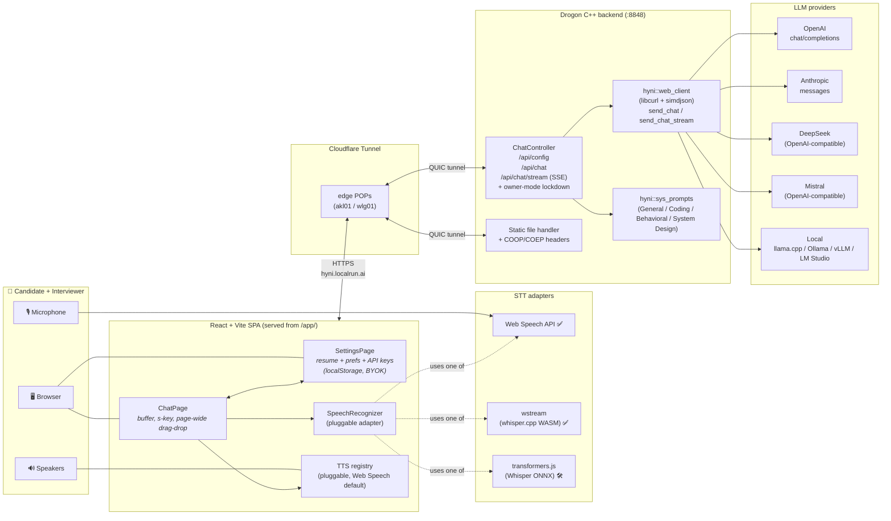
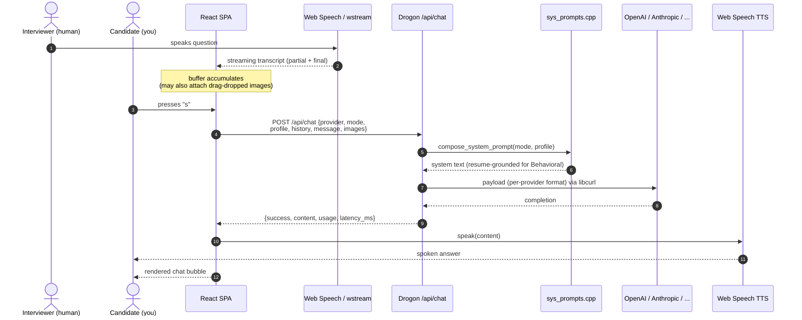

# hyni.web

A self-hosted, single-user web app for **practicing live interviews and reducing
interview anxiety**. A human friend or partner plays the interviewer; the app
captures the question via speech-to-text, sends it to an LLM enriched with
*your* resume and target role, and returns a tailored answer — rendered as
text and spoken back through TTS so you can hear how it sounds and internalize
the delivery.

> Live at **<https://hyni.localrun.ai>** via Cloudflare Tunnel.

---

## Table of contents

- [What it does](#what-it-does)
- [Architecture](#architecture)
  - [System diagram](#system-diagram)
  - [Request lifecycle](#request-lifecycle)
- [Components & stack](#components--stack)
- [Repository layout](#repository-layout)
- [Quick start](#quick-start)
- [Configuration](#configuration)
- [Session UX](#session-ux)
- [Roadmap](#roadmap)
- [License](#license)

---

## What it does

1. You and a human **interviewer** sit together in front of one device.
2. You pick one of three **modes** that shape the LLM's behaviour:

   | Mode              | What the LLM produces                                                    |
   |-------------------|--------------------------------------------------------------------------|
   | **General**       | Concise, interview-appropriate answer on any topic.                      |
   | **Coding**        | Working code — Python by default, unless the prompt names another language. Adds a one-paragraph complexity note. Covers EVERY code unit visible in attached screenshots, not just the first. |
   | **Behavioral**    | Strict **STAR** answer (Situation / Task / Action / Result), grounded **only** in concrete experiences from *your* stored resume. No invented stories. Reply starts directly with `Situation:` — no preamble. |
   | **System Design** | Full 9-section senior-architect response (requirements → capacity → HLD → diagram blueprint → component deep-dive → data → API → reliability → trade-offs). Weaves in the five capabilities interviewers grade on. |

3. You hit **🎙 Start listening**. STT runs continuously, appending the
   interviewer's words to a live transcript buffer (which you can edit).
4. Press **`s`** to send the buffered transcript (plus any attached images)
   to the LLM. The reply is added to the chat and (optionally) **spoken
   aloud** via TTS — off by default; toggle in Settings.
5. **Settings** page stores your resume, target role / job description,
   additional notes, API keys, and provider preferences in `localStorage`,
   so every request is auto-enriched with *your* context.

---

## Architecture

### System diagram



Legend: ✅ wired, 🛠 stub in place — drop-in integration pending.

### Request lifecycle



---

## Components & stack

### Backend — `backend/`

| Concern             | Choice                                                                                    |
|---------------------|-------------------------------------------------------------------------------------------|
| Language            | **C++23** (GNU/Clang)                                                                      |
| HTTP framework      | [Drogon](https://github.com/drogonframework/drogon) v1.9.7 (pulled via CPM / FetchContent) |
| Build               | CMake ≥ 3.20, optional `ccache`                                                            |
| Release flags       | `-O3 -pipe -flto -march=znver5 -fno-plt` + `-Wl,-z,now,-z,relro` (toggle off with `-DHYNI_NATIVE_OPTS=OFF` for portable builds) |
| Debug flags         | `-O0 -g -fsanitize=address,undefined`                                                      |
| HTTP client         | libcurl (HTTP/2, system)                                                                  |
| **JSON parsing**    | **simdjson** 4.x ondemand (2-4 GB/s, system shared lib)                                    |
| JSON building       | nlohmann/json (header-only, ergonomic API)                                                 |
| Threading           | Drogon's IO loops; LLM calls dispatched off the accept loop                                |
| State               | Fully stateless `/api/chat` and `/api/chat/stream`; the SPA owns conversation history       |
| LLM providers       | OpenAI · Anthropic · DeepSeek · Mistral · **Local** (llama.cpp / Ollama / vLLM / LM Studio). DeepSeek + Mistral + Local share the OpenAI wire format. |
| Curated model picker | Per-provider model catalogue exposed via `/api/config` (frontend renders a dropdown — no free-text typos). |
| **Streaming**       | **`POST /api/chat/stream`** — SSE chunked, parses provider SSE frames, normalizes to `{delta}` events. Handles reasoning-model `reasoning_content` / `reasoning` fields (Qwen3 / DeepSeek-R1 / GPT-5). |
| Multimodal          | Per-provider `image_url` / `source.image` base64 attachments. Silently dropped for providers that reject them (DeepSeek, Local).            |
| BYOK + lockdown     | Per-request `api_key` (client) wins over server env var. `HYNI_OWNER_TOKEN` env enables guest lockdown — guests must BYOK; owner bearer unlocks server keys. Constant-time compare. |
| Per-provider quirks | GPT-5 family `temperature` is omitted (only the implicit default `1` is accepted). DeepSeek and Local image content is dropped (text-only). Reasoning models surface `reasoning_content`. |
| Cross-origin policy | `COOP: same-origin`, `COEP: credentialless`, `CORP: cross-origin` on every response (for WASM threading on the frontend) |

Source map:

```
backend/src/
├── main.cc                       # Drogon entry + global COOP/COEP advice
├── controllers/ChatController.*  # /api/config, /api/chat, /api/chat/stream (SSE)
└── hyni/
    ├── types.h                   # API_PROVIDER, QUESTION_TYPE, image_data, ...
    ├── sys_prompts.{h,cpp}       # composes mode-specific system prompts
    └── web_client.{h,cpp}        # stateless payload builder + libcurl POST
                                  # + send_chat_stream() with SSE frame parser
```

### Frontend — `frontend/`

| Concern              | Choice                                                              |
|----------------------|---------------------------------------------------------------------|
| Framework            | React 19                                                            |
| Bundler              | Vite 8                                                              |
| Language             | TypeScript (strict, `verbatimModuleSyntax`)                         |
| Routing              | `react-router-dom` (HashRouter — works without SPA fallback config) |
| Persistence          | `localStorage` only — `hyni:profile`, `hyni:settings` (schema-versioned) |
| State                | Chat history survives Chat ↔ Settings nav via a small `ChatStoreProvider` context (ephemeral on refresh — fresh interview each load) |
| Styling              | Hand-written CSS (no framework) — small, fast, themable             |
| STT                  | **Pluggable** `SpeechRecognizer` registry (`stt/registry.ts`). Adapters self-register at startup: **Web Speech API** ✅ (default; Chrome/Edge/Safari, free, Google cloud), **wstream** ✅ (whisper.cpp WASM, private, slow on CPU), **transformers.js** 🛠 (Whisper ONNX, stub) |
| TTS                  | **Pluggable** `Speaker` registry (`tts/registry.ts`) — Web Speech default; Piper / ElevenLabs stubs ready |
| Multimodal           | Drag-and-drop **anywhere** on the chat page → base64 → forwarded with next send. Full-screen overlay while dragging. |
| PDF resume           | `pdfjs-dist` extracts text fully client-side (resume PII never leaves the browser) |
| Hotkey               | Global `s` to send (suppressed inside inputs/textareas)             |
| Branding             | Inline-SVG hyni mark (purple chip + lowercase `h` + ascending sound-wave dots) used as favicon, apple-touch-icon, mask-icon, and header logo |
| Feng-shui badge      | Header chip + per-message dot fetch from <https://fengshui.overhired.work> (cached, fail-safe) |

Source map:

```
frontend/src/
├── App.tsx, main.tsx, styles.css
├── pages/
│   ├── ChatPage.tsx        # main interview practice page
│   └── SettingsPage.tsx    # resume + provider + API keys + local URL + voice + ...
├── components/
│   ├── ChatMessages.tsx
│   ├── ImageDropZone.tsx
│   ├── ModeToggle.tsx
│   ├── FengShuiBadge.tsx   # header chip
│   └── DayDot.tsx          # per-message auspice dot
├── state/
│   └── ChatStore.tsx       # context that survives Chat↔Settings navigation
├── stt/                    # pluggable speech-to-text
│   ├── types.ts            # SpeechRecognizer interface + capabilities
│   ├── registry.ts         # adapter self-registration
│   ├── init.ts             # static side-effect imports (load order)
│   ├── WebSpeechAdapter.ts ✅
│   ├── WstreamAdapter.ts   ✅ (whisper.cpp WASM via public/wstream/)
│   ├── TransformersJsAdapter.ts 🛠
│   └── useSpeechRecognizer.ts
├── tts/                    # pluggable text-to-speech (mirrors stt/)
│   ├── types.ts, registry.ts, init.ts, useSpeaker.ts
│   ├── WebSpeechSpeaker.ts ✅
│   ├── PiperSpeaker.ts     🛠
│   └── ElevenLabsSpeaker.ts 🛠
└── lib/
    ├── api.ts              # /api/* fetch + SSE stream consumer
    ├── storage.ts          # typed localStorage wrapper (schema migrations)
    ├── pdf.ts              # client-side PDF text extraction (pdfjs-dist)
    ├── fengshui.ts         # shared cached client for fengshui.overhired.work
    ├── files.ts            # File -> base64 helper
    └── types.ts            # shared shapes (mirrors backend JSON)
```

### Deployment — `cloudflared/`

| Concern   | Choice                                                                  |
|-----------|-------------------------------------------------------------------------|
| Hostname  | `https://hyni.localrun.ai`                                              |
| Transport | Cloudflare Tunnel (QUIC, 4 edge connections: `akl01`, `wlg01`)           |
| Mode      | Added to an existing global `~/.cloudflared/config.yml` ingress list    |
| TLS       | Provided by Cloudflare; origin (`:8848`) is plain HTTP on `localhost`    |

---

## Repository layout

```
hyni.web/
├── backend/              # Drogon C++ server
│   ├── CMakeLists.txt
│   ├── cmake/CPM.cmake   # bundled CPM for Drogon FetchContent
│   ├── config/drogon.json
│   ├── schemas/          # reference payload schemas (OpenAI, Claude)
│   ├── src/
│   │   ├── controllers/  # HTTP endpoint handlers
│   │   ├── hyni/         # in-tree, customised LLM client + sys_prompts
│   │   └── main.cc
│   └── tests/            # GTest integration suite (opt-in: -DHYNI_BUILD_TESTS=ON)
│       ├── test_chat_api.cpp
│       └── fixtures/     # real screenshots for multi-image regression tests
├── frontend/             # React + Vite + TypeScript SPA
│   ├── src/{pages,components,stt,tts,lib}/
│   ├── index.html
│   └── vite.config.ts    # base: '/app/', dev proxy -> :8848
├── public/               # served by Drogon at /
│   ├── favicon.svg       # hyni mark (purple chip + lowercase h)
│   ├── index.html        # tiny / -> /app/ redirect
│   ├── app/              # Vite build output (gitignored)
│   └── wstream/          # whisper.cpp WASM + Silero VAD + ORT (~40 MB)
├── cloudflared/
│   ├── README.md
│   └── config.standalone.example.yml
├── scripts/
│   ├── build.sh          # frontend + backend in one shot
│   ├── run.sh            # exports .env, runs the binary
│   └── fetch-models.sh   # optional: pre-download Whisper weights to public/wstream/models/
└── .env.example
```

---

## Quick start

### Prerequisites

- CMake ≥ 3.20, a **C++23** compiler (gcc 13+ / clang 17+)
- System: `libcurl`, `nlohmann/json`, **`simdjson`** ≥ 3.x, OpenSSL, zlib, c-ares, uuid
- Node ≥ 20, npm ≥ 10
- `cloudflared` (only needed for the public hostname)

### One-shot build + run

```bash
git clone <repo> hyni.web && cd hyni.web

cp .env.example .env
# edit .env — add any subset of:
#   OPENAI_API_KEY, ANTHROPIC_API_KEY, DEEPSEEK_API_KEY, MISTRAL_API_KEY
#   LOCAL_LLM_URL=http://localhost:8080/v1/chat/completions   (llama.cpp)
#   HYNI_OWNER_TOKEN=<your passphrase>   (optional: lock down server keys)

scripts/build.sh    # builds frontend (Vite) then backend (CMake + Drogon)
scripts/run.sh      # exports .env and launches Drogon on :8848
```

Then open <http://localhost:8848>. The root redirects to `/app/`, the SPA.

### Integration tests (GTest)

A live, opt-in test suite covers the API end-to-end (config shape, owner
mode, per-provider text + multimodal round-trips, behavioral preamble
regression, coding mode covers all visible methods, SSE streaming). Built
behind a flag so default builds stay dependency-light:

```bash
cmake -S backend -B backend/build -DHYNI_BUILD_TESTS=ON
cmake --build backend/build --target hyni_web_tests -j

# 4 free validation tests
./backend/build/tests/hyni_web_tests --gtest_filter='*Config*:*Bad*:*Missing*:*Unknown*'

# Full live pass (sends ~10 small LLM calls; ~$0.01-0.05 in real spend)
HYNI_TESTS_LIVE_LLM=1 HYNI_TEST_OWNER_TOKEN=<your-token> \
  ./backend/build/tests/hyni_web_tests
```

### Frontend dev server (HMR)

```bash
cd frontend
npm run dev         # http://localhost:5173 — proxies /api -> :8848
```

The Vite dev server sends the same COOP/COEP headers as Drogon so the wstream
WASM adapter works in development too.

### Public hostname via Cloudflare Tunnel

See [`cloudflared/README.md`](cloudflared/README.md). Add this single ingress
entry to your `~/.cloudflared/config.yml`, above the catch-all:

```yaml
- hostname: hyni.localrun.ai
  service: http://localhost:8848
```

Then:

```bash
cloudflared tunnel route dns <tunnel-name-or-uuid> hyni.localrun.ai
# restart cloudflared (or SIGTERM + start) to reload the ingress list
```

Visit <https://hyni.localrun.ai>. TLS, HTTP/2, and the COOP/COEP/CORP headers
all flow through transparently.

---

## Configuration

### API keys (`backend` reads from environment)

| Env var              | Provider     | Default model                |
|----------------------|--------------|------------------------------|
| `OPENAI_API_KEY`     | OpenAI       | `gpt-4o`                     |
| `ANTHROPIC_API_KEY`  | Anthropic    | `claude-sonnet-4-5-20250929` |
| `DEEPSEEK_API_KEY`   | DeepSeek     | `deepseek-chat`              |
| `MISTRAL_API_KEY`    | Mistral      | `mistral-large-latest`       |
| `LOCAL_LLM_URL`      | Local        | `http://localhost:8080/v1/chat/completions` |
| `LOCAL_LLM_API_KEY`  | Local        | *(optional; usually unset)*  |
| `HYNI_OWNER_TOKEN`   | *(meta)*     | unset → open mode; set → owner-only access to server keys |

`GET /api/config` reports which providers have keys configured, the
curated model dropdown for each, plus `owner_mode_enabled` / `is_owner`
flags so the Settings page reacts automatically.

### Drogon (`backend/config/drogon.json`)

Edit to change listening port, log level, max body size, etc. The default
binds `0.0.0.0:8848` and serves `./public` with the cross-origin isolation
headers required by SharedArrayBuffer / WASM threads.

### Running as a systemd user service

For long-running deployments (e.g. behind the Cloudflare Tunnel), run
the backend as a per-user systemd unit — no root needed, auto-restart
on crash, logs to the journal. The repo ships a ready-to-use unit at
[`systemd/hyni.service`](systemd/hyni.service):

```bash
mkdir -p ~/.config/systemd/user
ln -sf "$(pwd)/systemd/hyni.service" ~/.config/systemd/user/hyni.service
systemctl --user daemon-reload
systemctl --user enable --now hyni.service

# inspect
systemctl --user status hyni.service
journalctl --user -u hyni -f
```

By default, user units only run while you have an active session
(login on tty or SSH). To keep hyni up at boot and across logouts:

```bash
sudo loginctl enable-linger "$USER"
```

The unit reads `.env` from the repo root via `EnvironmentFile=`, so any
edit + `systemctl --user restart hyni` reloads keys. Override the repo
path (default `~/proj/priv/hyni.web`) with `systemctl --user edit hyni`
if you cloned elsewhere.

### Frontend (`localStorage`)

- `hyni:profile` — `{resume_text, target_role, extra_notes}` (target_role doubles as the full job description; extra_notes is a free-text catch-all that can include per-mode conditional instructions)
- `hyni:settings` — `{provider, model, api_keys, owner_token, local_url, stt_engine, tts_engine, tts_voice_uri, tts_rate, tts_pitch, temperature, max_tokens, speak_replies, stream_replies, _schema}` — schema-versioned so default flips (e.g. `speak_replies: true → false` in v2) apply once per browser

Both are editable from the **Settings** page and persisted client-side only.

---

## Owner-mode lockdown

When you host hyni at a public URL (Cloudflare Tunnel etc.) and don't
want random visitors burning your LLM credits:

```bash
# .env on the server
HYNI_OWNER_TOKEN=Auckland2023        # any non-empty string, ideally 3-4 words
```

Restart the server. Behaviour flips:

| `HYNI_OWNER_TOKEN` | Visitor with matching bearer | Visitor without / wrong bearer |
|---|---|---|
| unset (default) | open mode — server keys available to all | same |
| **set** | recognised as owner, uses server keys for free | must BYOK in Settings → API keys, or get **HTTP 402** with a helpful message |

The frontend's **Settings → Owner token** section appears automatically
when the server reports lockdown is on; paste the same value, hit Save,
and your browser will carry `Authorization: Bearer …` on every API call.
Share the token with friends you trust over Signal/Bitwarden — they
become owners on their own machine without you doing anything else.

Token comparison on the server is constant-time. Rotate any time by
editing `.env` and restarting; old tokens become guests instantly.

---

## Local LLM (llama.cpp / Ollama / vLLM / LM Studio)

Pick the **`local`** provider in Settings → LLM provider, then paste your
endpoint URL in the **Local LLM endpoint** field (plain text — it's not a
secret). Examples:

| Runtime    | URL                                                          |
|------------|--------------------------------------------------------------|
| llama.cpp  | `http://localhost:8080/v1/chat/completions` (default)        |
| Ollama     | `http://localhost:11434/v1/chat/completions`                 |
| vLLM       | `http://localhost:8000/v1/chat/completions`                  |
| LM Studio  | `http://localhost:1234/v1/chat/completions`                  |

No API key required by default. Reasoning models (Qwen3, DeepSeek-R1)
are handled: their `reasoning_content` field is surfaced when `content`
is empty, and the SSE parser passes through `delta.reasoning_content`
chunks live. Give them headroom on `max_tokens` (4096+) so they can
finish thinking AND answer.

---

## Session UX

1. **Settings** → paste your resume (PDF or text), set role / job
   description, add additional notes, save.
2. **Chat** → pick a mode (General / Coding / Behavioral / **System
   Design**).
3. **🎙 Start listening** — STT streams the interviewer's words into the
   buffer. Press the mic icon in the browser address bar to grant
   permission on first use.
4. (Optional) drag-and-drop a whiteboard photo or code screenshot
   **anywhere** on the chat page. A full-screen overlay confirms the
   drop target.
5. Press **`s`** — buffer + images flush to the LLM. The reply streams in
   live (cursor blinking on the trailing edge).
6. The buffer clears so you're ready for the next question. Conversation
   history is kept in memory and sent on every turn (survives Chat ↔
   Settings nav via context; cleared on page refresh).

Hotkey safety: the `s` listener checks for focused `<input>` /
`<textarea>` and skips firing — type freely in any field without
accidental sends.

---

## Roadmap

- [x] Drogon backend (C++23) with COOP/COEP, OpenAI + Anthropic + DeepSeek + Mistral + Local
- [x] React/Vite SPA: Chat + Settings pages
- [x] Four modes: General, Coding, Behavioral (STAR), System Design
- [x] Resume-grounded STAR + role/JD-aware framing
- [x] Coding mode auto-covers every visible code unit (real-screenshot regression test)
- [x] Drag-and-drop multimodal images (page-wide drop target with overlay)
- [x] PDF resume parsing (pdfjs-dist, fully client-side)
- [x] BYOK + owner-mode lockdown (constant-time bearer compare)
- [x] Local LLM provider (llama.cpp / Ollama / vLLM / LM Studio); reasoning-model `reasoning_content` surfaced
- [x] Per-provider quirk handling (GPT-5 temperature, DeepSeek text-only, Local text-only)
- [x] Curated per-provider model dropdown surfaced via `/api/config`
- [x] **simdjson** ondemand parsing throughout (request + LLM responses + SSE frames)
- [x] **Streaming** via `POST /api/chat/stream` — SSE, normalised across providers, with frontend live-render + cancel
- [x] Production-grade Release codegen: C++23, `-O3 -pipe -flto -march=znver5 -fno-plt`
- [x] Cloudflare Tunnel exposing `hyni.localrun.ai`
- [x] **wstream WASM** adapter shipped (whisper.cpp + Silero VAD); usable but sub-realtime on CPU
- [x] hyni mark — purple-gradient logo as favicon / mask-icon / header brand
- [x] Feng-shui auspice — header chip + per-message lucky-day dot (fengshui.overhired.work)
- [x] Per-provider integration tests (GTest) including the live multi-image regression
- [ ] Wire **transformers.js Whisper** adapter (Hugging Face ONNX) — stub registered
- [ ] Conversation persistence + export
- [ ] HTTP/2 keep-alive pool to provider endpoints (currently one TLS handshake per turn)

---

## License

See [LICENSE](LICENSE).
