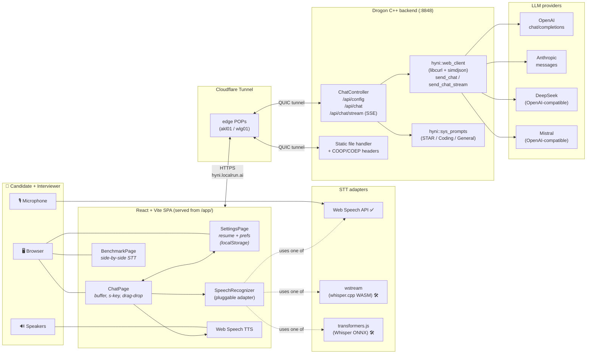
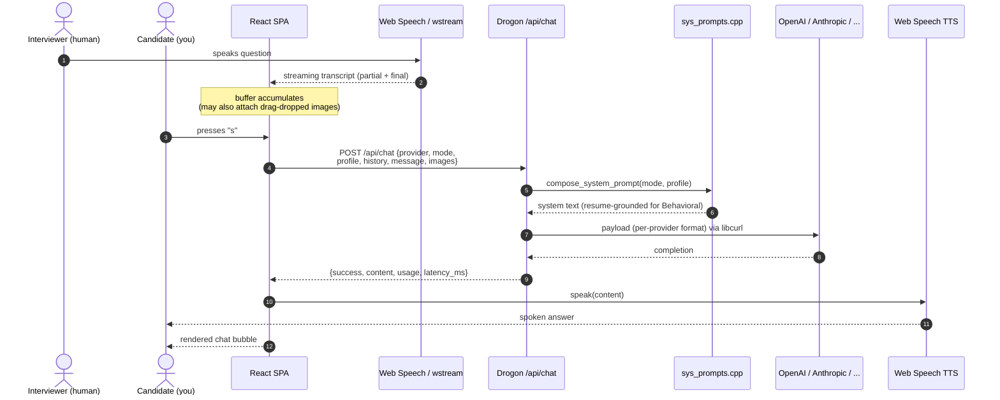

# hyni.web

A self-hosted, single-user web app for **practicing live interviews and reducing
interview anxiety**. A human friend or partner plays the interviewer; the app
captures the question via speech-to-text, sends it to an LLM enriched with
*your* resume and target role, and returns a tailored answer — rendered as
text and spoken back through TTS so you can hear how it sounds and internalize
the delivery.

> Live at **<https://hyni.localrun.ai>** via Cloudflare Tunnel.

---

## Table of contents

- [What it does](#what-it-does)
- [Architecture](#architecture)
  - [System diagram](#system-diagram)
  - [Request lifecycle](#request-lifecycle)
- [Components & stack](#components--stack)
- [Repository layout](#repository-layout)
- [Quick start](#quick-start)
- [Configuration](#configuration)
- [Session UX](#session-ux)
- [Roadmap](#roadmap)
- [License](#license)

---

## What it does

1. You and a human **interviewer** sit together in front of one device.
2. You pick one of three **modes** that shape the LLM's behaviour:

   | Mode           | What the LLM produces                                                    |
   |----------------|--------------------------------------------------------------------------|
   | **General**    | Concise, interview-appropriate answer on any topic.                      |
   | **Coding**     | Working code — Python by default, unless the prompt names another language. Adds a one-paragraph complexity note. |
   | **Behavioral** | Strict **STAR** answer (Situation / Task / Action / Result), grounded **only** in concrete experiences from *your* stored resume. No invented stories. |

3. You hit **🎙 Start listening**. STT runs continuously, appending the
   interviewer's words to a live transcript buffer (which you can edit).
4. Press **`s`** to send the buffered transcript (plus any attached images)
   to the LLM. The reply is added to the chat and **spoken aloud** via TTS so
   you can practice listening and delivery.
5. **Settings** page stores your resume, target role, strengths,
   weaknesses, and provider preferences in `localStorage`, so every request
   is auto-enriched with *your* context.

---

## Architecture

### System diagram



Legend: ✅ wired, 🛠 stub in place — drop-in integration pending.

### Request lifecycle



---

## Components & stack

### Backend — `backend/`

| Concern             | Choice                                                                                    |
|---------------------|-------------------------------------------------------------------------------------------|
| Language            | **C++23** (GNU/Clang)                                                                      |
| HTTP framework      | [Drogon](https://github.com/drogonframework/drogon) v1.9.7 (pulled via CPM / FetchContent) |
| Build               | CMake ≥ 3.20, optional `ccache`                                                            |
| Release flags       | `-O3 -pipe -flto -march=znver5 -fno-plt` + `-Wl,-z,now,-z,relro` (toggle off with `-DHYNI_NATIVE_OPTS=OFF` for portable builds) |
| Debug flags         | `-O0 -g -fsanitize=address,undefined`                                                      |
| HTTP client         | libcurl (HTTP/2, system)                                                                  |
| **JSON parsing**    | **simdjson** 4.x ondemand (2-4 GB/s, system shared lib)                                    |
| JSON building       | nlohmann/json (header-only, ergonomic API)                                                 |
| Threading           | Drogon's IO loops; LLM calls dispatched off the accept loop                                |
| State               | Fully stateless `/api/chat` and `/api/chat/stream`; the SPA owns conversation history       |
| LLM providers       | OpenAI · Anthropic · DeepSeek · Mistral (DeepSeek & Mistral share OpenAI wire format)       |
| **Streaming**       | **`POST /api/chat/stream`** — SSE chunked, parses provider SSE frames, normalizes to `{delta}` events |
| Multimodal          | Per-provider `image_url` / `source.image` base64 attachments                               |
| Cross-origin policy | `COOP: same-origin`, `COEP: credentialless`, `CORP: cross-origin` on every response (for WASM threading on the frontend) |

Source map:

```
backend/src/
├── main.cc                       # Drogon entry + global COOP/COEP advice
├── controllers/ChatController.*  # /api/config, /api/chat, /api/chat/stream (SSE)
└── hyni/
    ├── types.h                   # API_PROVIDER, QUESTION_TYPE, image_data, ...
    ├── sys_prompts.{h,cpp}       # composes mode-specific system prompts
    └── web_client.{h,cpp}        # stateless payload builder + libcurl POST
                                  # + send_chat_stream() with SSE frame parser
```

### Frontend — `frontend/`

| Concern              | Choice                                                              |
|----------------------|---------------------------------------------------------------------|
| Framework            | React 19                                                            |
| Bundler              | Vite 8                                                              |
| Language             | TypeScript (strict, `verbatimModuleSyntax`)                         |
| Routing              | `react-router-dom` (HashRouter — works without SPA fallback config) |
| Persistence          | `localStorage` only (`hyni:profile`, `hyni:settings`)               |
| Styling              | Hand-written CSS (no framework) — small, fast, themable             |
| STT                  | **Pluggable** `SpeechRecognizer` interface:                         |
|                      | – Web Speech API ✅ (Chrome/Edge/Safari)                              |
|                      | – wstream (whisper.cpp WASM) 🛠 stub                                  |
|                      | – transformers.js (Whisper ONNX) 🛠 stub                              |
| TTS                  | Web Speech API (SpeechSynthesis)                                    |
| Multimodal           | Drag-and-drop image → base64 → forwarded with next send             |
| Hotkey               | Global `s` to send (suppressed inside inputs/textareas)             |

Source map:

```
frontend/src/
├── App.tsx, main.tsx, styles.css
├── pages/
│   ├── ChatPage.tsx        # main interview practice page
│   ├── SettingsPage.tsx    # resume + provider/STT/TTS prefs
│   └── BenchmarkPage.tsx   # side-by-side STT comparison
├── components/
│   ├── ChatMessages.tsx
│   ├── ImageDropZone.tsx
│   └── ModeToggle.tsx
├── stt/
│   ├── types.ts                  # SpeechRecognizer interface
│   ├── WebSpeechAdapter.ts       # ✅ wired
│   ├── WstreamAdapter.ts         # 🛠 stub
│   ├── TransformersJsAdapter.ts  # 🛠 stub
│   └── index.ts                  # registry + factory
├── tts/
│   └── webspeech.ts
└── lib/
    ├── api.ts          # /api/* fetch client
    ├── storage.ts      # typed localStorage wrapper
    ├── files.ts        # File -> base64 helper
    └── types.ts        # shared shapes (mirrors backend JSON)
```

### Deployment — `cloudflared/`

| Concern   | Choice                                                                  |
|-----------|-------------------------------------------------------------------------|
| Hostname  | `https://hyni.localrun.ai`                                              |
| Transport | Cloudflare Tunnel (QUIC, 4 edge connections: `akl01`, `wlg01`)           |
| Mode      | Added to an existing global `~/.cloudflared/config.yml` ingress list    |
| TLS       | Provided by Cloudflare; origin (`:8848`) is plain HTTP on `localhost`    |

---

## Repository layout

```
hyni.web/
├── backend/              # Drogon C++ server
│   ├── CMakeLists.txt
│   ├── cmake/CPM.cmake   # bundled CPM for Drogon FetchContent
│   ├── config/drogon.json
│   ├── schemas/          # reference payload schemas (OpenAI, Claude)
│   └── src/
│       ├── controllers/  # HTTP endpoint handlers
│       ├── hyni/         # in-tree, customised LLM client
│       └── main.cc
├── frontend/             # React + Vite + TypeScript SPA
│   ├── src/{pages,components,stt,tts,lib}/
│   ├── index.html
│   └── vite.config.ts    # base: '/app/', dev proxy -> :8848
├── public/               # served by Drogon at /
│   ├── index.html        # tiny / -> /app/ redirect
│   ├── app/              # Vite build output (gitignored)
│   └── wstream/          # whisper.cpp WASM assets (added during wstream wiring)
├── cloudflared/
│   ├── README.md
│   └── config.standalone.example.yml
├── scripts/
│   ├── build.sh          # frontend + backend in one shot
│   └── run.sh            # exports .env, runs the binary
└── .env.example
```

---

## Quick start

### Prerequisites

- CMake ≥ 3.20, a C++20 compiler (gcc 12+ / clang 16+)
- System: `libcurl`, `nlohmann/json`, OpenSSL, zlib, c-ares, uuid
- Node ≥ 20, npm ≥ 10
- `cloudflared` (only needed for the public hostname)

### One-shot build + run

```bash
git clone <repo> hyni.web && cd hyni.web

cp .env.example .env
# edit .env — add OPENAI_API_KEY / ANTHROPIC_API_KEY /
# DEEPSEEK_API_KEY / MISTRAL_API_KEY (any subset).

scripts/build.sh    # builds frontend (Vite) then backend (CMake + Drogon)
scripts/run.sh      # exports .env and launches Drogon on :8848
```

Then open <http://localhost:8848>. The root redirects to `/app/`, the SPA.

### Frontend dev server (HMR)

```bash
cd frontend
npm run dev         # http://localhost:5173 — proxies /api -> :8848
```

The Vite dev server sends the same COOP/COEP headers as Drogon so the wstream
WASM adapter works in development too.

### Public hostname via Cloudflare Tunnel

See [`cloudflared/README.md`](cloudflared/README.md). Add this single ingress
entry to your `~/.cloudflared/config.yml`, above the catch-all:

```yaml
- hostname: hyni.localrun.ai
  service: http://localhost:8848
```

Then:

```bash
cloudflared tunnel route dns <tunnel-name-or-uuid> hyni.localrun.ai
# restart cloudflared (or SIGTERM + start) to reload the ingress list
```

Visit <https://hyni.localrun.ai>. TLS, HTTP/2, and the COOP/COEP/CORP headers
all flow through transparently.

---

## Configuration

### API keys (`backend` reads from environment)

| Env var              | Provider     | Default model              |
|----------------------|--------------|----------------------------|
| `OPENAI_API_KEY`     | OpenAI       | `gpt-4o`                   |
| `ANTHROPIC_API_KEY`  | Anthropic    | `claude-sonnet-4-5-20250929` |
| `DEEPSEEK_API_KEY`   | DeepSeek     | `deepseek-chat`            |
| `MISTRAL_API_KEY`    | Mistral      | `mistral-large-latest`     |

`GET /api/config` reports which providers have keys configured, so the
Settings page disables / annotates entries automatically.

### Drogon (`backend/config/drogon.json`)

Edit to change listening port, log level, max body size, etc. The default
binds `0.0.0.0:8848` and serves `./public` with the cross-origin isolation
headers required by SharedArrayBuffer / WASM threads.

### Frontend (`localStorage`)

- `hyni:profile` — `{resume_text, target_role, strengths, weaknesses, extra_notes}`
- `hyni:settings` — `{provider, model, stt_engine, tts_voice_uri, tts_rate, tts_pitch, temperature, max_tokens, speak_replies}`

Both are editable from the **Settings** page and persisted client-side only.

---

## Session UX

1. **Settings** → paste your resume, set target role, save.
2. **Chat** → pick a mode (General / Coding / Behavioral).
3. **🎙 Start listening** — STT streams the interviewer's words into the
   buffer.
4. (Optional) drag-and-drop a whiteboard photo or code screenshot into the
   chat panel.
5. Press **`s`** — buffer + images flush to the LLM. The reply is displayed
   and (by default) spoken aloud.
6. The buffer clears so you're ready for the next question. Conversation
   history is kept in memory and sent on every turn, so the LLM has context.

Hotkey safety: the `s` listener checks for focused `<input>` / `<textarea>`
and skips firing — type freely in any field without accidental sends.

---

## Roadmap

- [x] Drogon backend (C++23) with COOP/COEP, OpenAI + Anthropic + DeepSeek + Mistral
- [x] React/Vite SPA: Chat, Settings, Benchmark pages
- [x] STAR + resume grounding for Behavioral mode
- [x] Python-default for Coding mode
- [x] Drag-and-drop multimodal images
- [x] Cloudflare Tunnel exposing `hyni.localrun.ai`
- [x] **simdjson** ondemand parsing throughout (request + LLM responses + SSE frames)
- [x] **Streaming** via `POST /api/chat/stream` — SSE, normalised across providers, with frontend live-render + cancel
- [x] Production-grade Release codegen: C++23, `-O3 -pipe -flto -march=znver5 -fno-plt`
- [ ] Wire the **wstream WASM** adapter (whisper.cpp + Silero VAD in browser)
- [ ] Wire the **transformers.js Whisper** adapter (Hugging Face ONNX)
- [ ] PDF resume parsing on the Settings page
- [ ] Conversation persistence + export
- [ ] HTTP/2 keep-alive pool to provider endpoints (currently one TLS handshake per turn)

---

## License

See [LICENSE](LICENSE).
